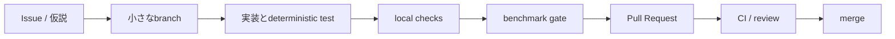
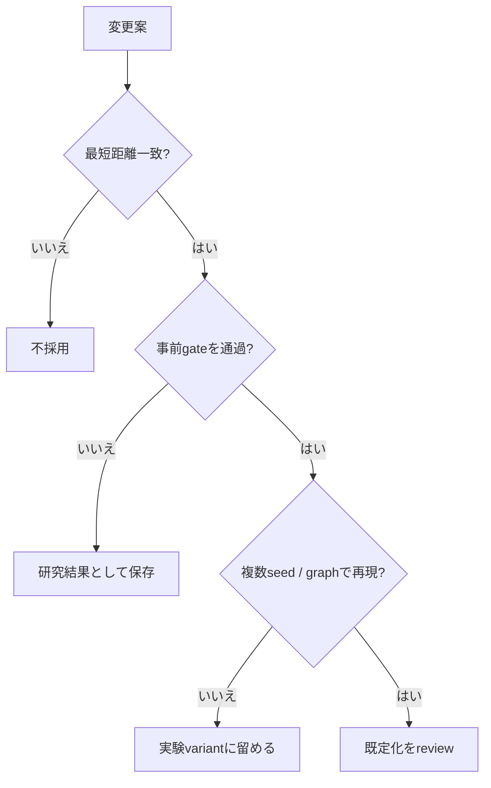

<div align="center">

# Aegis ACBSへのコントリビューション

**正確性を壊さず、測定を再現可能にし、失敗した実験も追跡できる変更を歓迎します。**


[ドキュメント一覧](docs/README.md) · [アルゴリズム](docs/ALGORITHM.md) · [正確性](docs/CORRECTNESS.md) · [トップ](README.ja.md)

</div>

---

## 基本方針

<table>
<tr>
<td align="center"><strong>Exactness</strong><br><sub>Dijkstraとの差分検査を維持</sub></td>
<td align="center"><strong>Reproducibility</strong><br><sub>seed・command・raw reportを保存</sub></td>
<td align="center"><strong>Predeclared gates</strong><br><sub>結果を見る前に採用条件を固定</sub></td>
<td align="center"><strong>Negative results</strong><br><sub>不採用実験も消さない</sub></td>
</tr>
</table>

Aegis ACBSは研究prototypeです。変更は、厳密性、再現性、観測可能性を同時に維持する必要があります。

## 開発フロー



1. 変更理由をIssueまたはPR本文に書く
2. 変更範囲を1つの仮説・修正へ絞る
3. 正確性testとregression fixtureを追加する
4. 大規模結果を見る前にperformance gateを定義する
5. raw resultと再現commandを保存する
6. 成功・失敗を含めてPRへ記録する

## セットアップ

```bash
git clone https://github.com/lasder-ca/aegis-acbs.git
cd aegis-acbs

go test ./...
go build -o bin/aegis ./cmd/aegis
```

必要環境はGo 1.23以降です。OSM PBF importを変更する場合は`osmium-tool`も使用します。

## ローカル検査

```bash
gofmt -w cmd internal
go test ./...
go vet ./...
go test -race ./internal/search ./internal/graph ./internal/bench ./internal/server
bash -n scripts/*.sh
python3 -m py_compile scripts/*.py
```

| 検査 | 対象 |
|---|---|
| `gofmt` | Go sourceのformat |
| `go test ./...` | unit / differential / report test |
| `go vet ./...` | 静的な誤り候補 |
| `go test -race` | workspace poolやserverのdata race |
| `bash -n` | shell script構文 |
| `py_compile` | release / gate script構文 |

> [!IMPORTANT]
> READMEや文書だけの変更でもCIは全platformで実行します。command example、path、flagが実装と一致しているか確認してください。

## 変更種別ごとの要件

### アルゴリズム・scheduler

すべて必須です。

- Dijkstraとのrandomizedまたはexhaustive comparison
- 特定query修正時のdeterministic regression fixture
- 上界・下界・停止条件の不変性確認
- 証明が変わる場合の[正確性文書](docs/CORRECTNESS.md)更新
- 大規模benchmarkを見る前に定義したacceptance gate
- latencyだけでなくexpanded / relaxed / memoryの比較
- 不採用時も結果を残す



> [!WARNING]
> 結果を見た後でthresholdを緩めないでください。gateを変更する場合は、その変更理由を別実験として事前に記録します。

### ベンチマーク

- 全方式で同じgraphとquery pairを使う
- measurement orderをinterleaveまたはdeterministic rotateする
- runtime、work、allocation、correctnessを別々に報告する
- 1方式だけへpreprocessingを追加しない。追加する場合は時間とindex sizeを報告する
- raw JSONと完全なcommand lineを保存する
- 極小fixtureのratioだけで性能を主張しない
- p95 / p99と絶対penaltyを確認する

詳細は[ベンチマーク方法](docs/BENCHMARKING.md)を参照してください。

### importer・データ形式

- malformed inputのtestを追加する
- one-wayとreverse adjacencyを検査する
- edge count、profile、metricのregressionを確認する
- untrusted inputとしてresource consumptionを考慮する
- format変更時は後方互換性またはmigration方針を記載する

### CLI・レポート

- `--help`またはusageを更新する
- JSON fieldの互換性を確認する
- HTMLがself-containedのままか検査する
- Windows / Linux / macOSのpath差を考慮する
- 既存scriptのflagを壊す変更はmigration noteを付ける

### ドキュメント

- 日本語を主文書として自然に書く
- code identifierや一般的な研究用語は必要に応じて英語を残す
- 「何ではないか」より「何をするか」を先に書く
- 事実、観測、推論、未確認事項を分ける
- Mermaid、table、GitHub Alertを使い、長文を構造化する
- 存在しないcommandや推測の数値を書かない

## Pull Request checklist

```markdown
- [ ] 変更目的を1〜3文で説明した
- [ ] gofmt / go test / go vetを実行した
- [ ] 必要なrace testを実行した
- [ ] Dijkstraとの正確性比較を追加・維持した
- [ ] 新しいflagと出力形式を文書化した
- [ ] benchmark条件とraw resultを保存した
- [ ] gateを結果確認前に定義した
- [ ] 不利な結果や制約もPRへ書いた
- [ ] READMEとdocsのリンクを確認した
```

## 研究上の表現

独立した証拠がない状態で、academic noveltyやuniversal superiorityを主張しません。

避ける表現:

- 世界初
- 常に最速
- 既存方式を完全に上回る
- すべての道路網で有効

推奨する表現:

- 対象graph、query数、metric、実行環境を明示する
- 「観測した」「再現した」「この条件では」と書く
- 未確認事項と次の検証を併記する

関連研究の修正、反例、不採用結果の追加も歓迎します。

## セキュリティ問題

脆弱性の可能性がある場合は、公開Issueではなく[セキュリティポリシー](SECURITY.md)に従って非公開で報告してください。

---

<div align="center">

[Issueを開く](https://github.com/lasder-ca/aegis-acbs/issues/new/choose) · [セキュリティ](SECURITY.md) · [ドキュメント一覧](docs/README.md)

</div>
