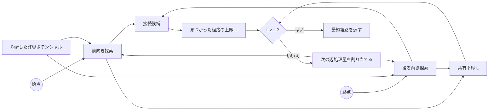

<div align="center">

# Aegis ACBS

**共有する下界を使い、最短性を保ちながら進める双方向経路探索。**

<sub>道路グラフ向け研究CLI · OSM / DIMACS · JSON / CSV / 単体HTMLレポート</sub>

<br>

[](https://github.com/lasder-ca/aegis-acbs/actions/workflows/ci.yml)


[](LICENSE)

[English](README.md) · [技術文書](docs/README.md) · [アルゴリズム](docs/ALGORITHM.md) · [東京での検証](docs/TOKYO_EVIDENCE.md)

</div>

---

Aegis Coupled-Bound Search（ACBS）は、始点側と終点側の探索を一つの厳密な探索として扱います。両方向が許容できる下界を共有し、見つかった最良の完全経路を上界として保持。次にどちら側を進めるかは、下界を効率よく押し上げている方向を見ながら調整します。

> [!IMPORTANT]
> ACBSは再現可能な研究プロトタイプです。学術的な新規性と、異なる道路網でも同じ性能が得られるかについては、第三者による検証が完了していません。

## 特徴

| 最短性を保つ探索 | 処理量の動的な配分 | 道路グラフの取り込み | 再現できる評価 |
|---|---|---|---|
| 有限かつ非負の重みを持つ有向グラフで、厳密な最短経路を返します。 | 最短性の条件を変えず、前向き・後ろ向き探索へ割り当てる辺処理量を調整します。 | OSM XMLとDIMACSを読み込み、Aegisのバイナリグラフへ変換します。 | 比較測定、遅いケースの分析、判定条件の追跡結果をJSON・CSV・単体HTMLで保存します。 |

## 経路を確定するまで



動的に変えるのは探索する順序だけです。許容ポテンシャル、共有下界、見つかった経路、停止条件は変更しません。

## 東京での検証

最初の公開版には、**2026年7月18日**に実行した東京の時間重み付き道路グラフ検証を収録しています。対象は**611,846ノード**、**1,235,323有向辺**です。

| 結果 | 観測内容 |
|---|---|
| **10,000 / 10,000** | Dijkstraと最短距離が一致 |
| **2 / 11** | 初回に遅かったケースが、隔離した再測定でも再現 |
| **0 / 3** | 事前に定めた条件を通過した保護ルール候補 |
| **1件** | 同じ測定群の中でcheckpoint 48の診断条件に一致 |

再現した遅いケースは、動的な配分が原因のものと、既存方式が継続して有利だったものが各1件でした。

> [!NOTE]
> この結果は、一つのグラフ、問い合わせ設計、実行環境で得られた観測です。すべての道路網で高速であることを示すものではありません。生データ、合格条件、不採用にした実験は[東京での検証記録](docs/TOKYO_EVIDENCE.md)へ保存しています。

## クイックスタート

必要環境はGo 1.23以降です。

```bash
git clone https://github.com/lasder-ca/aegis-acbs.git
cd aegis-acbs

go test ./...
go build -o bin/aegis ./cmd/aegis
```

同梱のOSMデータを取り込みます。

```bash
bin/aegis import-osm \
  --input benchdata/hatfield-uk.osm \
  --output /tmp/hatfield-distance.aegis \
  --profile car \
  --metric distance
```

比較レポートを生成します。

```bash
bin/aegis benchmark \
  --graph /tmp/hatfield-distance.aegis \
  --queries 1000 \
  --repeats 9 \
  --order interleaved \
  --measure-memory \
  --suite mixed \
  --seed 1010 \
  --output /tmp/hatfield.json \
  --html /tmp/hatfield.html
```

生成されるHTMLは単体で開けるため、表示用のサーバーや外部ライブラリは不要です。

## 主なコマンド

| 分類 | コマンド | 用途 |
|---|---|---|
| データ | `import-osm`, `import-dimacs`, `inspect` | 元データの変換と確認 |
| 経路探索 | `route` | 1件の最短経路を計算 |
| 評価 | `benchmark`, `stress` | 反復測定と並行負荷試験 |
| 遅いケースの分析 | `diagnose`, `replay-regret` | 問い合わせ単位の遅延を検出し、隔離して再測定 |
| 配分方法の研究 | `profile-trigger` | 各確認地点で、前後の探索状態を記録 |
| 集約 | `aggregate` | 複数の乱数シードを使った測定結果を集約 |
| ローカル画面 | `serve` | ローカルHTTP画面を起動 |

標準の比較対象にはDijkstra、双方向Dijkstra、地理的A*、固定配分版ACBS、動的配分版ACBSを含みます。不採用にした実験方式も、結果を再現できるようにするため残しています。

## 技術文書

| 文書 | 内容 |
|---|---|
| [アルゴリズム](docs/ALGORITHM.md) | 状態、上下界、ポテンシャル、配分方法、停止条件 |
| [正確性](docs/CORRECTNESS.md) | 最短性の根拠、不変条件、補題、機械的な検査 |
| [測定方法](docs/BENCHMARKING.md) | 実行順序、統計、メモリ、比較値の読み方 |
| [東京での検証](docs/TOKYO_EVIDENCE.md) | 大規模グラフ、生データ、判定条件、不採用実験 |
| [関連研究](docs/RELATED_WORK.md) | 既存の双方向探索との関係と主張できる範囲 |
| [データ形式](docs/DATA.md) | OSM、PBF、DIMACS、Aegisグラフ形式 |
| [コントリビューション](CONTRIBUTING.md) | 開発手順と検証要件 |
| [セキュリティ](SECURITY.md) | 信頼できない入力と非公開報告の方法 |

## 現在の制限

- 性能はグラフ、重み、経路長、実行環境によって変わります。
- 公開済みの大規模検証は、現時点では東京の時間グラフが中心です。
- checkpoint 48の条件は同じ測定群の中で発見と評価を行っているため、診断結果としてのみ扱います。
- contraction hierarchiesやlandmarksなど、グラフ固有の前処理は使っていません。
- 学術的な新規性と一般化性能には、独立したレビューと追試が必要です。

## リリースとライセンス

`v0.1.0`が最初の公開版です。CHANGELOGに記載されたそれ以前の番号は、公開前の研究過程を示します。

[MIT License](LICENSE)で公開しています。
