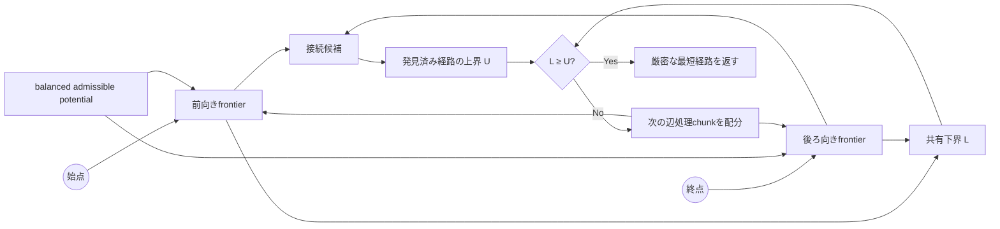

<div align="center">

# Aegis ACBS

**共有下界で最短性を証明する、厳密な双方向最短経路探索。**

<sub>道路グラフ向け研究CLI · OSM / DIMACS · JSON / CSV / 単体HTMLレポート</sub>

<br>

[](https://github.com/lasder-ca/aegis-acbs/actions/workflows/ci.yml)


[](LICENSE)

[English](README.md) · [ドキュメント一覧](docs/README.md) · [アルゴリズム](docs/ALGORITHM.md) · [東京検証](docs/TOKYO_EVIDENCE.md)

</div>

---

Aegis Coupled-Bound Searchは、始点側と終点側のfrontierを1つの厳密探索として進めます。両方向で許容下界を共有し、発見済みの最良完全経路を上界として維持します。適応schedulerは、下界をより効率よく押し上げている側へ次の辺処理chunkを配分します。

> [!IMPORTANT]
> ACBSは、再現可能な研究プロトタイプとして公開しています。学術的新規性と、他の道路網への性能一般化は第三者検証前です。

## ひと目で分かる特徴

| 厳密な経路探索 | 適応的な探索配分 | 道路グラフ対応 | 再現可能な評価 |
|:--|:--|:--|:--|
| 有限・非負重みの有向グラフで最短経路を返します。 | 最短性の証明を変えず、前後frontierの辺処理量を動的に調整します。 | OSM XMLとDIMACSを取り込み、Aegisバイナリグラフへ変換します。 | benchmark、tail解析、trigger解析をJSON、CSV、単体HTMLで保存します。 |

## ACBSが答えを確定するまで



schedulerが変えるのは探索順序だけです。許容potential、共有下界、発見済み経路、厳密な停止条件は変更しません。

## 検証結果の要約

最初の公開版には、**2026年7月18日**にユーザー環境で実行した東京の時間重み付き道路グラフ検証を収録しています。グラフ規模は**611,846ノード**、**1,235,323有向辺**です。

<table>
<tr>
<td align="center"><strong>10,000 / 10,000</strong><br><sub>Dijkstraと最短距離が一致</sub></td>
<td align="center"><strong>2 / 11</strong><br><sub>初回slowdownが隔離再測定でも再現</sub></td>
<td align="center"><strong>0 / 3</strong><br><sub>事前定義ゲートを通過したguard候補</sub></td>
<td align="center"><strong>1件一致</strong><br><sub>同一suite内のcheckpoint-48診断ルール</sub></td>
</tr>
</table>

| 再現したtail分類 | 観測率 |
|---|---:|
| 適応scheduler由来 | 1 / 10,000 |
| 既存方式が継続的に有利 | 1 / 10,000 |

> [!NOTE]
> これは1つのグラフ、クエリ設計、実行環境に対する観測です。すべての道路網で高速であることを示すものではありません。生データ、合格基準、不採用実験は[東京検証の記録](docs/TOKYO_EVIDENCE.md)に保存しています。

## クイックスタート

**必要環境:** Go 1.23以降。

### 1. ビルドとテスト

```bash
git clone https://github.com/lasder-ca/aegis-acbs.git
cd aegis-acbs

go test ./...
go build -o bin/aegis ./cmd/aegis
```

### 2. 同梱のOSM fixtureを取り込む

```bash
bin/aegis import-osm \
  --input benchdata/hatfield-uk.osm \
  --output /tmp/hatfield-distance.aegis \
  --profile car \
  --metric distance
```

### 3. 比較レポートを生成する

```bash
bin/aegis benchmark \
  --graph /tmp/hatfield-distance.aegis \
  --queries 1000 \
  --repeats 9 \
  --order interleaved \
  --measure-memory \
  --suite mixed \
  --seed 1010 \
  --output /tmp/hatfield.json \
  --html /tmp/hatfield.html
```

生成されるHTMLは単体で開けるため、別のサーバーや外部依存は不要です。

## CLIマップ

| 分類 | コマンド | 用途 |
|---|---|---|
| データ | `import-osm`, `import-dimacs`, `inspect` | 元データをAegisグラフへ変換・確認 |
| 経路探索 | `route` | 1件の厳密な最短経路を計算 |
| 評価 | `benchmark`, `stress` | 反復測定と並行負荷試験 |
| tail解析 | `diagnose`, `replay-regret` | クエリ単位のslowdownを検出・隔離 |
| scheduler研究 | `profile-trigger` | checkpointごとのfrontier特徴量を記録 |
| 集約 | `aggregate` | 複数seedのbenchmark matrixを生成 |
| local UI | `serve` | local HTTP interfaceを起動 |

標準比較にはDijkstra、双方向Dijkstra、地理A*、固定scheduler版ACBS、適応scheduler版ACBSを含めます。不採用の実験変種は、結果を再現できるようにする目的だけで残しています。

<details>
<summary><strong>tail解析の再現コマンド</strong></summary>

```bash
# 複数seedでtailを検証
scripts/validate-tail.sh path/to/time-graph.aegis artifacts/tail

# 保持したケースを隔離再測定
bin/aegis replay-regret \
  --graph path/to/time-graph.aegis \
  --validation artifacts/tail/regret-validation.json \
  --input-root artifacts/tail \
  --runs 31 \
  --warmup 5 \
  --output artifacts/replay.json \
  --csv artifacts/replay.csv \
  --html artifacts/replay.html

# 全suiteのscheduler特徴量を記録
bin/aegis profile-trigger \
  --graph path/to/time-graph.aegis \
  --validation artifacts/tail/regret-validation.json \
  --replay artifacts/replay.json \
  --input-root artifacts/tail \
  --checkpoints 24,32,40,48 \
  --max-matches 5 \
  --output artifacts/trigger-profile.json \
  --csv artifacts/trigger-profile.csv \
  --html artifacts/trigger-profile.html
```

</details>

## ドキュメント

<div align="center">

**[すべての技術文書を一覧で見る →](docs/README.md)**

</div>

<table>
<tr>
<td width="50%" valign="top">

### 仕組みを理解する

- **[アルゴリズム](docs/ALGORITHM.md)**  
  状態、上下界、potential、scheduler、停止条件
- **[正確性](docs/CORRECTNESS.md)**  
  最短性の根拠、不変条件、補題、機械検査
- **[関連研究](docs/RELATED_WORK.md)**  
  既存の双方向探索研究との関係、主張の境界

</td>
<td width="50%" valign="top">

### 実験を理解・再現する

- **[ベンチマーク方法](docs/BENCHMARKING.md)**  
  測定順序、統計、メモリ、比較値、tail解析
- **[東京検証](docs/TOKYO_EVIDENCE.md)**  
  大規模graph、生データ、gate、不採用実験
- **[データ形式](docs/DATA.md)**  
  OSM、PBF、DIMACS、Aegis graph形式

</td>
</tr>
<tr>
<td width="50%" valign="top">

### 開発する

- **[コントリビューション](CONTRIBUTING.md)**  
  開発flow、検証要件、PR checklist

</td>
<td width="50%" valign="top">

### 安全に運用・報告する

- **[セキュリティ](SECURITY.md)**  
  untrusted input、非公開報告、運用guidance

</td>
</tr>
</table>

## 現在の境界

- 性能はグラフ、重み、経路長、実行環境によって変わります。
- 公開済みの大規模検証は、現時点では東京の時間グラフが中心です。
- checkpoint 48のルールは同一suite内で発見・評価しているため、診断結果としてのみ保持しています。
- contraction hierarchies、landmarksなどのグラフ固有前処理は使っていません。
- 学術的新規性と一般化性能には、独立したレビューと追試が必要です。

## リリースとライセンス

`v0.1.0`が最初の公開版です。CHANGELOGにあるそれ以前の番号は、公開前の研究反復を示します。

[MIT License](LICENSE)で公開しています。
