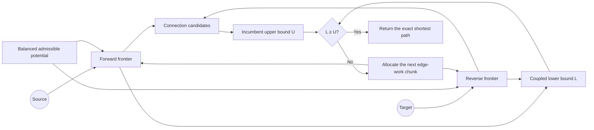

<div align="center">

# Aegis ACBS

**Exact bidirectional shortest-path search with a shared proof of optimality.**

<sub>Road-graph research CLI · OSM / DIMACS · JSON / CSV / self-contained HTML reports</sub>

<br>

[](https://github.com/lasder-ca/aegis-acbs/actions/workflows/ci.yml)


[](LICENSE)

[日本語](README.ja.md) · [Algorithm](docs/ALGORITHM.md) · [Correctness](docs/CORRECTNESS.md) · [Tokyo evidence](docs/TOKYO_EVIDENCE.md)

</div>

---

Aegis Coupled-Bound Search advances forward and reverse frontiers inside one exact search. Both directions share an admissible lower bound, while the best complete route found so far supplies an upper bound. An adaptive scheduler assigns the next edge-work chunk to the frontier that is making more useful lower-bound progress.

> [!IMPORTANT]
> ACBS is published as a reproducible research prototype. Academic novelty and performance generalization have not yet been independently established.

## At a glance

| Exact routing | Adaptive work | Road-graph tooling | Reproducible evaluation |
|:--|:--|:--|:--|
| Returns a shortest path on finite, non-negative weighted directed graphs. | Shifts edge-processing effort between two frontiers without changing the proof of optimality. | Imports OSM XML and DIMACS, then stores a compact Aegis binary graph. | Produces JSON, CSV, and portable HTML reports for benchmarks and tail analysis. |

## How ACBS reaches a proven answer



The scheduler changes exploration order only. It does not replace the admissible potential, the coupled lower bound, the incumbent path, or the exact stopping condition.

## Evidence snapshot

The first public release includes a user-run Tokyo travel-time experiment from **July 18, 2026** on a graph with **611,846 nodes** and **1,235,323 directed edges**.

<table>
<tr>
<td align="center"><strong>10,000 / 10,000</strong><br><sub>shortest-path distances matched Dijkstra</sub></td>
<td align="center"><strong>2 / 11</strong><br><sub>initial slowdown cases reproduced in isolation</sub></td>
<td align="center"><strong>0 / 3</strong><br><sub>guard candidates passed the predefined gate</sub></td>
<td align="center"><strong>1 match</strong><br><sub>in-sample checkpoint-48 diagnostic trigger</sub></td>
</tr>
</table>

| Reproduced tail class | Observed rate |
|---|---:|
| Adaptive-scheduler tail | 1 / 10,000 |
| Persistent classical tail | 1 / 10,000 |

> [!NOTE]
> These figures describe one graph, workload design, and machine environment. They are experimental observations, not a universal speed claim. Raw reports, acceptance criteria, and rejected experiments are preserved in [Tokyo evidence](docs/TOKYO_EVIDENCE.md).

## Quick start

**Requirements:** Go 1.23 or newer.

### 1. Build and test

```bash
git clone https://github.com/lasder-ca/aegis-acbs.git
cd aegis-acbs

go test ./...
go build -o bin/aegis ./cmd/aegis
```

### 2. Import the bundled OSM fixture

```bash
bin/aegis import-osm \
  --input benchdata/hatfield-uk.osm \
  --output /tmp/hatfield-distance.aegis \
  --profile car \
  --metric distance
```

### 3. Generate a benchmark report

```bash
bin/aegis benchmark \
  --graph /tmp/hatfield-distance.aegis \
  --queries 1000 \
  --repeats 9 \
  --order interleaved \
  --measure-memory \
  --suite mixed \
  --seed 1010 \
  --output /tmp/hatfield.json \
  --html /tmp/hatfield.html
```

The HTML output is self-contained and can be opened directly in a browser.

## CLI map

| Area | Commands | Purpose |
|---|---|---|
| Data | `import-osm`, `import-dimacs` | Convert source data into an Aegis graph |
| Routing | `route` | Compute one exact point-to-point route |
| Evaluation | `benchmark`, `stress` | Measure repeated and concurrent routing workloads |
| Tail analysis | `diagnose`, `replay-regret` | Detect and isolate meaningful per-query slowdowns |
| Scheduler research | `profile-trigger` | Record deterministic frontier features at checkpoints |
| Aggregation | `aggregate` | Build multi-seed benchmark matrices |

The standard benchmark set contains Dijkstra, bidirectional Dijkstra, geographic A*, static ACBS, and adaptive ACBS. Rejected experimental variants remain available only so their results can be reproduced.

<details>
<summary><strong>Reproduce the tail-analysis workflow</strong></summary>

```bash
# Multi-seed tail validation
scripts/validate-tail.sh path/to/time-graph.aegis artifacts/tail

# Isolated replay of retained cases
bin/aegis replay-regret \
  --graph path/to/time-graph.aegis \
  --validation artifacts/tail/regret-validation.json \
  --input-root artifacts/tail \
  --runs 31 \
  --warmup 5 \
  --output artifacts/replay.json \
  --csv artifacts/replay.csv \
  --html artifacts/replay.html

# Whole-suite scheduler-feature profiling
bin/aegis profile-trigger \
  --graph path/to/time-graph.aegis \
  --validation artifacts/tail/regret-validation.json \
  --replay artifacts/replay.json \
  --input-root artifacts/tail \
  --checkpoints 24,32,40,48 \
  --max-matches 5 \
  --output artifacts/trigger-profile.json \
  --csv artifacts/trigger-profile.csv \
  --html artifacts/trigger-profile.html
```

</details>

## Documentation

| Document | Contents |
|---|---|
| [Algorithm](docs/ALGORITHM.md) | State, bounds, potential, scheduling, and termination |
| [Correctness](docs/CORRECTNESS.md) | Exactness argument and invariants |
| [Benchmarking](docs/BENCHMARKING.md) | Timing order, statistics, memory, and comparison semantics |
| [Tokyo evidence](docs/TOKYO_EVIDENCE.md) | Large-graph results, raw evidence, gates, and failed experiments |
| [Related work](docs/RELATED_WORK.md) | Relationship to existing bidirectional-search research |
| [Data formats](docs/DATA.md) | OSM, DIMACS, and Aegis graph formats |
| [Contributing](CONTRIBUTING.md) | Development and validation requirements |
| [Security](SECURITY.md) | Vulnerability reporting policy |

## Current boundaries

- Performance depends on the graph, metric, route length, and hardware.
- Public large-graph evidence currently centers on one Tokyo travel-time graph.
- The checkpoint-48 trigger was discovered and evaluated on the same suite, so it remains diagnostic only.
- ACBS currently uses no contraction hierarchies, landmarks, or graph-specific preprocessing.
- Independent novelty review and broader third-party reproduction are still required.

## Release and license

`v0.1.0` is the first public research release. Earlier version numbers in the changelog refer to private research iterations.

Released under the [MIT License](LICENSE).
