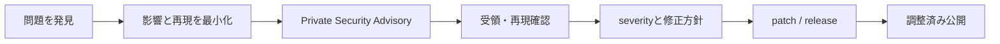

<div align="center">

# セキュリティポリシー

**脆弱性は公開Issueではなく、GitHubの非公開Security Advisoryから報告してください。**


[非公開で報告する](https://github.com/lasder-ca/aegis-acbs/security/advisories/new) · [ドキュメント一覧](docs/README.md) · [トップ](README.ja.md)

</div>

---

> [!CAUTION]
> 脆弱性の詳細、再現入力、攻撃手順を公開Issueへ投稿しないでください。修正または調整済みの公開計画が整う前に情報が広がると、利用者を危険にさらす可能性があります。

## 対象範囲

Aegis ACBSは、local graph fileを処理し、任意でlocal HTTP interfaceを公開できます。

| surface | 主なrisk |
|---|---|
| OSM XML / PBF | malformed input、resource exhaustion、unexpected tag handling |
| DIMACS `.gr` / `.co` | parser error、integer edge case、巨大入力 |
| Aegis `.aegis` | corrupted binary、size validation、memory consumption |
| local HTTP server | unintended network exposure、input validation、DoS |
| release artifact | tampering、checksum mismatch、supply-chain risk |

外部から受け取ったOSM、DIMACS、Aegis graphは、すべて**untrusted input**として扱ってください。

## 対応バージョン

| version | security fix |
|---|:---:|
| 最新の公開release tag | ✓ |
| 過去のpre-1.0 release | 原則対象外 |
| private research iteration | 対象外 |
| fork / modified build | 対象外 |

このprojectはpre-1.0です。古いpreviewへ長期security supportを提供する保証はありません。

## 報告方法



GitHubのPrivate Vulnerability ReportingまたはSecurity Advisoryを使用してください。

**報告先:** [New security advisory](https://github.com/lasder-ca/aegis-acbs/security/advisories/new)

含める情報:

- 影響を受けるversionまたはcommit
- OS、architecture、Go version
- 最小のreproducerまたはmalformed input
- 観測したimpact
- 期待するbehavior
- local HTTP server経由で到達可能か
- crash log、stack trace、sanitizer output
- 公開希望時期や既知の第三者共有範囲

> [!NOTE]
> 実データに個人情報や秘密情報が含まれる場合は、再現に必要な最小部分へ置き換えてください。token、credential、private map dataを送らないでください。

## severityの目安

| severity候補 | 例 |
|---|---|
| Critical | remote code execution、release supply-chain compromise |
| High | network経由のarbitrary file access、容易なpersistent service compromise |
| Medium | crafted inputによるreliable crash、resource exhaustion、情報漏えい |
| Low | 制限されたlocal conditionでのみ発生する軽微なissue |

最終severityは、到達経路、必要権限、再現性、impactを基に調整します。

## 運用ガイド

<table>
<tr>
<td width="50%" valign="top">

### file import

- ordinary user privilegeで実行する
- untrusted fileは専用directoryで処理する
- CPU、memory、file size、実行時間へlimitを設定する
- import後のnode / edge countを確認する
- disk残量とtemporary fileを監視する

</td>
<td width="50%" valign="top">

### HTTP interface

- 既定では`127.0.0.1`へbindする
- network公開が不要なら外部interfaceへbindしない
- reverse proxy、authentication、rate limitなしでinternet公開しない
- process privilegeを最小化する
- timeoutとrequest sizeを制限する

</td>
</tr>
</table>

## releaseの確認

```bash
sha256sum -c SHA256SUMS
```

- official GitHub Releaseから取得する
- `SHA256SUMS`と一致するか確認する
- tagとrelease noteを確認する
- 出所不明のbinaryをproductionへ置かない
- SBOMがある場合はdependencyとversionを確認する

## projectのsecurity境界

> [!WARNING]
> Aegis ACBSは研究prototypeです。独立security review、hardening、operational monitoringなしに、public-facing production routing serviceとして扱わないでください。

現在、次は保証しません。

- hostile multi-tenant environmentでのisolation
- arbitrary-size inputへの完全なresource protection
- production-grade authentication / authorization
- turn restrictionを含むnavigation correctness
- long-term support branch

## 公開Issueで扱える内容

次は通常Issueで報告できます。

- security impactのないdocument typo
- expected behaviorを伴う一般的なbug
- performance regression
- feature request
- reproducibility question

security impactを判断できない場合は、非公開報告を選んでください。

---

<div align="center">

[非公開で報告する](https://github.com/lasder-ca/aegis-acbs/security/advisories/new) · [コントリビューション](CONTRIBUTING.md) · [データ形式](docs/DATA.md)

</div>
