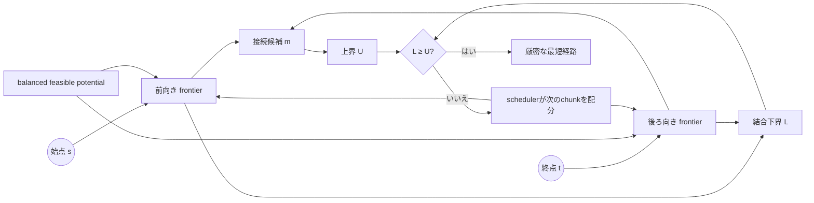

<div align="center">

# ACBS アルゴリズム

**共有下界と適応的な辺処理配分を組み合わせた、厳密な双方向最短経路探索。**


[ドキュメント一覧](README.md) · [正確性](CORRECTNESS.md) · [ベンチマーク](BENCHMARKING.md) · [トップ](../README.ja.md)

</div>

---

## 要点

<table>
<tr>
<td align="center"><strong>2方向</strong><br><sub>始点側と終点側のfrontier</sub></td>
<td align="center"><strong>1つの証明</strong><br><sub>共有下界と共通上界</sub></td>
<td align="center"><strong>適応配分</strong><br><sub>辺処理chunkを動的に配る</sub></td>
<td align="center"><strong>厳密停止</strong><br><sub>下界が上界へ到達したら終了</sub></td>
</tr>
</table>

Aegis Coupled-Bound Search（ACBS）は、有限な有向グラフ上で1対1の厳密最短経路を求めます。辺重みは非負整数です。道路グラフでは、元の隣接構造と全辺を反転した逆隣接構造を使用します。

適応部分が変更するのは**探索順序だけ**です。最短性は、実行可能なpotential、上下界、接続候補、停止条件によって保証されます。

## 全体像



## 探索状態

始点を`s`、終点を`t`、任意の頂点を`v`とします。

| 記号 | 意味 |
|---|---|
| `OPEN_F` | 前向き探索のpriority queue |
| `OPEN_B` | 後ろ向き探索のpriority queue |
| `g_F(v)` | `s`から`v`までに判明している最小コスト |
| `g_B(v)` | `v`から`t`までに判明している最小コスト |
| `U` | 発見済みの完全経路の最小コスト（incumbent upper bound） |
| `L` | 未確定経路が下回れない許容下界 |

> [!IMPORTANT]
> `U`は実在する経路から作られる上界です。`L`はまだ調べ終えていない経路に対する下界です。`L ≥ U`になった時点で、未探索部分からより短い経路は現れません。

## 地理的下界

グラフ確定時に、緯度・経度を単位球面上の3次元座標へ変換します。

```text
q(v) = (x(v), y(v), z(v))
```

地球の弦距離は次です。

```text
chord(u, v) = R ||q(u) - q(v)||₂
```

弦距離は大円距離以下で、三角不等式を満たします。安全側に求めた1メートル当たりの最小コストを掛け、方向別の許容下界を作ります。

```text
h_F(v) = floor(chord(v, t) × min_cost_per_meter)
h_B(v) = floor(chord(s, v) × min_cost_per_meter)
```

座標または安全な`min_cost_per_meter`を得られない場合、両heuristicは`0`になります。この場合も正確性は維持されますが、地理情報による絞り込みは働きません。

## balanced feasible potential

ACBSは2倍整数表現のpotentialを使います。

```text
φ₂(v) = h_F(v) - h_B(v)
```

前後queueのkeyは次です。

```text
k_F(v) = 2g_F(v) + φ₂(v) - φ₂(s)
k_B(v) = 2g_B(v) + φ₂(t) - φ₂(v)
```

方向別heuristicの整合性により、両方向のreduced edge costは非負になります。したがって、各frontierはreduced-costグラフ上でDijkstra型のlabel-setting探索として進められます。

## 結合下界と上界

2つのqueueにある有効な最小keyを`min_F`、`min_B`とします。

```text
L₂ = min_F + min_B
```

両方向で有限labelを持つ接続頂点`m`が見つかるたび、上界を更新します。

```text
U  = min(U, g_F(m) + g_B(m))
U₂ = 2U + φ₂(t) - φ₂(s)
```

停止条件は次です。

```text
L₂ >= U₂
```

この時点で未確定経路は上界を改善できません。レポートには`upperBound`、`lowerBound`、`optimalityGap`を出力します。正常に証明された結果では`optimalityGap = 0`です。

## 適応edge-work scheduler

ACBSは、展開頂点数ではなく**確認した辺数**を基準に各方向をchunk単位で処理します。方向ごとに、結合下界をどれだけ効率よく押し上げたかを推定します。

```text
efficiency = lower_bound_gain
             / (relaxed_edges
                + 4 × expanded_nodes
                + 2 × positive_queue_growth)
```

| 入力 | schedulerでの役割 |
|---|---|
| 下界の増加量 | その方向が証明を進めた量 |
| 確認辺数 | 実際に消費した主な探索作業 |
| 展開頂点数 | queueから確定して処理した状態数 |
| queue増加量 | 将来へ積み残した探索量 |
| 次頂点の次数 | 次chunkの予想コスト |
| queue最小key | 現在の証明進行位置 |

推定値は平滑化され、片方向が飢餓状態にならないよう反対方向を定期的に強制samplingします。通常のedge budgetは256〜8192辺です。上界発見後は停止条件をより頻繁に確認するため最大chunkを縮小します。

schedulerは次を変更しません。

- reduced edge cost
- `g` label
- 上界`U`
- 結合下界`L`
- 停止条件

## queueとグラフ表現

確定済みグラフは、両方向をCSR形式で保持します。

```text
outOffsets, outEdges
inOffsets,  inEdges
```

priority queueには、非減少の整数keyを扱うmonotone radix heapを使用します。探索workspaceとqueueのbacking arrayはリクエスト間で再利用します。返却するpathだけは呼び出し側が所有する正確な長さのsliceです。

## 評価用variant

| 名前 | 目的 | 通常比較 |
|---|---|---:|
| `aegis` | balanced chord potential＋適応scheduler | ✓ |
| `aegis-static` | 同じ停止証明で方向schedulerを固定 | ✓ |
| `aegis-prune` | incumbent-bound pruningの実験 | 明示指定 |
| `aegis-projection` | 線形projection potentialの実験 | 明示指定 |

過去に不採用となったscheduler guardは、公開済み実験の再現だけを目的に残しています。標準benchmarkには含めません。

## 計算量

| 対象 | 上界 |
|---|---|
| 最悪時間計算量 | `O((V + E) log V)` |
| クエリごとのworkspace | `O(V)` |
| グラフ保存 | `O(V + E)` |

地理座標の単位ベクトルはグラフ確定時に1回だけ準備します。方向別heuristic値は、クエリ中に触れた頂点だけをcacheします。

## 現在の位置づけ

ACBSは、既存の最短経路探索要素と、結合下界の進行量に基づく適応的な辺処理配分を統合しています。実装、差分テスト、再現可能な実験は公開していますが、学術的新規性と他グラフへの性能一般化には独立した比較・査読が必要です。

---

<div align="center">

[正確性を読む](CORRECTNESS.md) · [関連研究を読む](RELATED_WORK.md) · [ドキュメント一覧](README.md)

</div>
