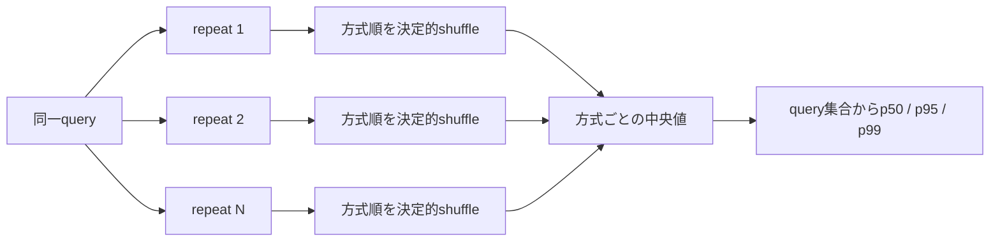

<div align="center">

# ACBS ベンチマーク方法

**測定順序、統計、メモリ、比較値、tail解析を再現可能にするためのルール。**


[ドキュメント一覧](README.md) · [アルゴリズム](ALGORITHM.md) · [東京検証](TOKYO_EVIDENCE.md) · [トップ](../README.ja.md)

</div>

---

## 測定の原則



Dijkstraは正確性の基準としてtimed sampleの外で実行します。比較対象は各repeat内でinterleaveし、seed・query番号・repeat番号から決まるshuffle順で1回ずつ測定します。

```text
各queryについて:
  各repeatについて:
    全方式の順序を決定的にshuffle
    その順で各方式を1回ずつ測定
  方式ごとにrepeat中央値を採用
```

| ルール | 理由 |
|---|---|
| 同じgraphとquery pairを使う | 入力差を排除する |
| 方式をinterleaveする | 熱・cache・実行順の偏りを弱める |
| 順序をseedから再現する | 同じ実験を再実行できる |
| Dijkstra検証をtimed sampleから外す | oracleのコストを測定へ混ぜない |
| 生JSONを保存する | 集計値だけでなくquery単位で監査する |

`--order rotated`は、過去のrotated-order手法と直接比較するときだけ使用します。

## latency統計

各queryについてrepeat中央値を作り、そのquery集合から集計します。

| フィールド | 意味 |
|---|---|
| `minNs` | 最小値（best） |
| `meanNs` | 算術平均 |
| `medianNs` | 中央値（p50） |
| `p95Ns` | 95パーセンタイル |
| `p99Ns` | 99パーセンタイル |
| `maxNs` | 最大値（worst） |

> [!WARNING]
> 極小fixtureはplatform timerの分解能へ近づきます。公開用のlatency主張では、実用規模graph、複数repeat、絶対時間差を使い、比率だけで結論を出しません。

## メモリ測定

`--measure-memory`は、latency測定とは別の非計時passをquery・方式ごとに追加します。

<table>
<tr>
<td width="50%" valign="top">

### query単位

- `allocBytes`: Go `TotalAlloc`の差分
- `allocObjects`: Go `Mallocs`の差分

計測用contextやharness周辺のallocationも含みます。

</td>
<td width="50%" valign="top">

### process全体

- `peakRssBytes`
- `goHeapAllocBytes`
- `goHeapSysBytes`
- `goTotalAllocBytes`
- `goMallocs`
- `goNumGc`

</td>
</tr>
</table>

LinuxとmacOSはpeak RSSを直接報告します。未対応platformでは`peakRssBytes = 0`となりますが、Go heapとallocation counterは使用できます。

```bash
scripts/memory-profile.sh path/to/graph.aegis
```

## speedupとregretの定義

```text
ratio of medians
  = median(Dijkstra query times) / median(candidate query times)

per-query speedup(q)
  = Dijkstra time(q) / candidate time(q)

median per-query speedup
  = median(per-query speedup)

geometric-mean speedup
  = exp(mean(log(per-query speedup)))
```

### 最速classical baselineとの比較

```text
fastest classical baseline
  = min(Dijkstra, bidirectional Dijkstra, A*)

runtime ratio
  = ACBS time / fastest classical baseline time

classical oracle regret
  = max(1, runtime ratio)
```

| 値 | 読み方 |
|---:|---|
| `< 1.0×` | ACBSが最速classical baselineより速い |
| `= 1.0×` | 同等 |
| `> 1.0×` | ACBSが遅い |

## 探索workのcounter

| counter | 意味 |
|---|---|
| `expanded` | adjacency listを処理した頂点数 |
| `relaxed` | 確認した辺数 |
| `queuePushes` / `queuePops` | priority queue操作 |
| `stalePops` | 古いlabelとして捨てたpop |
| `prunedAtPop` / `prunedAtRelax` | incumbent boundによる枝刈り |
| `connectionChecks` | 前後labelの接続確認回数 |
| `finiteMeetings` | 両方向labelが有限だった接続確認 |
| `upperBoundUpdates` | 上界を改善した接続 |

```text
connectionChecks >= finiteMeetings >= upperBoundUpdates
boundPruned = prunedAtPop + prunedAtRelax
```

latencyとworkは分けて解釈します。時間が速くても展開量が大幅に増えていれば、別環境で逆転する可能性があります。

## 標準benchmark

```bash
aegis benchmark \
  --graph city.aegis \
  --algorithms dijkstra,bidijkstra,astar,aegis-static,aegis \
  --queries 1000 \
  --repeats 9 \
  --order interleaved \
  --measure-memory \
  --output benchmark.json \
  --html benchmark.html
```

標準比較では、Dijkstra、双方向Dijkstra、地理A*、固定scheduler版ACBS、適応scheduler版ACBSを分けて表示します。実験variantやselectorの結果は主比較へ混ぜません。

## 公開規模の検証

```bash
GOMAXPROCS=1
AEGIS_ORDER=interleaved
AEGIS_QUERIES=1000
AEGIS_REPEATS=3
AEGIS_MEASURE_MEMORY=1
scripts/validate-research.sh
```

記録する環境情報:

- CPU modelとgovernor
- 温度・電源方針
- OSとGo version
- graph checksum
- import option
- 完全なcommand line
- raw JSON / CSV / HTML

p99を主張するときはquery数を1,000より増やし、confidence intervalも併記します。

## allocation regression

```bash
go test ./internal/search \
  -run '^$' \
  -bench '^BenchmarkACBSLargeGrid$' \
  -benchmem

scripts/compare-allocations.sh
```

このgrid fixtureはqueueとpath allocationを分離して確認するためのものです。実都市graphの性能検証を置き換えるものではありません。

## concurrencyとsoak

```bash
GOMAXPROCS=8 aegis stress \
  --graph city.aegis \
  --queries 10000 \
  --workers 8 \
  --verify-every 100 \
  --output stress.json
```

`verify-every=1`は全queryをDijkstraで検証します。値を大きくするとdeterministic samplingになります。`0`ではDijkstra比較を省略しますが、返却pathの連続性は検査します。

```bash
scripts/stress-matrix.sh city.aegis artifacts/stress
scripts/soak.sh city.aegis artifacts/soak
```

throughputだけでなくp95、p99、peak RSSを同時に報告します。

## meaningful slowdownの検出

```bash
aegis diagnose \
  --input benchmark.json \
  --ratio-threshold 1.25 \
  --penalty-floor 1ms \
  --output regret.json \
  --csv regret.csv \
  --html regret.html
```

短いqueryでは比率だけが大きくなりやすいため、既定では次の両方を満たす場合だけmeaningful slowdownとします。

```text
ACBS >= 1.25 × fastest classical baseline
absolute penalty >= 1 ms
```

## multi-seed validation

```bash
AEGIS_QUERIES=1000 \
AEGIS_SEEDS="1010 20260717 424242 8675309 123456789 314159265 271828182 161803398 141421356 173205080" \
scripts/validate-tail.sh city-time.aegis artifacts/tail-validation
```

各seedのreportを個別保存した後、`validate-regret`で最低10,000queryを集約します。event rateと95% intervalを併記し、0件の場合も「真の率が0」とは断定しません。

## 隔離replay

```bash
aegis replay-regret \
  --graph city-time.aegis \
  --validation validation/regret-validation.json \
  --input-root validation \
  --runs 31 \
  --warmup 5 \
  --output validation/regret-replay.json \
  --csv validation/regret-replay.csv \
  --html validation/regret-replay.html
```

| classification | 意味 |
|---|---|
| `not-reproduced` | 元のoutlierが隔離反復では再現しなかった |
| `adaptive-scheduler-tail` | 固定schedulerが適応schedulerを絶対時間floor以上で上回った |
| `persistent-classical-tail` | classical方式が速いが、固定schedulerでは説明できなかった |

traceはtimed runで記録しません。別の非計時runでscheduler chunkごとのeventを記録します。

## 変更を採用する条件

> [!IMPORTANT]
> 大規模結果を見る前にperformance gateを定義します。結果を見た後でthresholdを緩めません。

最低限、次を分けて確認します。

- 最短距離の一致
- latencyのmean / p50 / p95 / p99
- explored work
- allocationとRSS
- tailの絶対時間差
- 複数seedでの再現性

---

<div align="center">

[東京検証を見る](TOKYO_EVIDENCE.md) · [正確性を見る](CORRECTNESS.md) · [ドキュメント一覧](README.md)

</div>
