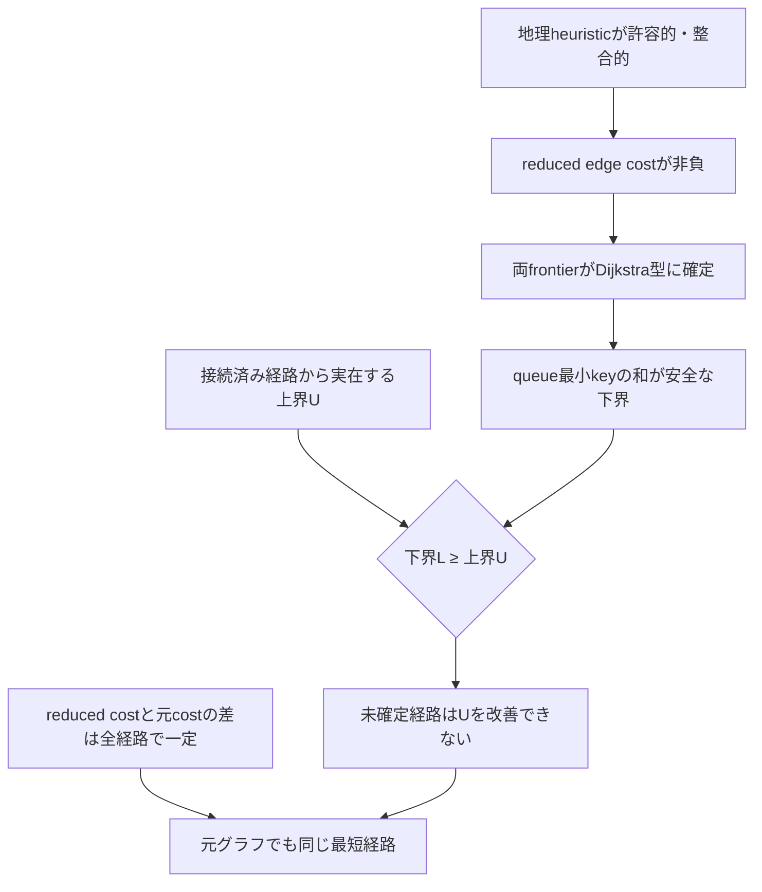

<div align="center">

# ACBSの正確性

**なぜ共有下界で停止しても、返す経路が厳密な最短経路になるのか。**


[ドキュメント一覧](README.md) · [アルゴリズム](ALGORITHM.md) · [ベンチマーク](BENCHMARKING.md) · [トップ](../README.ja.md)

</div>

---

## 証明の見取り図



> [!IMPORTANT]
> schedulerは、前向き・後ろ向きのどちらを先に処理するかだけを変えます。potential、reduced cost、上下界、停止条件を変えない限り、探索順序の変更は最短性へ影響しません。

## 仮定

| # | 仮定 |
|---:|---|
| 1 | グラフは有限である |
| 2 | 全辺コストは非負整数である |
| 3 | reverse adjacencyは元の有向辺を正確に反転する |
| 4 | `min_cost_per_meter`は、地理情報を持つ全辺の`cost / 大円距離`以下である |
| 5 | 浮動小数計算では安全側へ係数を縮小し、最後に切り捨てる |

座標または安全な`min_cost_per_meter`を得られない場合、heuristicを`0`にします。この場合は地理的な高速化を失いますが、Dijkstra型の正確性は維持されます。

## 補題1 — chord heuristicは許容的かつ整合的

地球単位球面上の弦距離は、大円距離以下です。また3次元ユークリッド距離なので三角不等式を満たします。

元の辺`u → v`について、

```text
chord(u, t) <= chord(u, v) + chord(v, t)
min_ratio × chord(u, v) <= cost(u, v)
```

したがって、

```text
h_F(u) <= cost(u, v) + h_F(v)
```

となります。`h_B`もreverse traversalに対して対称に整合的です。

| 性質 | 意味 |
|---|---|
| 許容性 | 実際の残りコストを超えない |
| 整合性 | 1辺進んだときのheuristic差が辺コストを超えない |
| 安全側の丸め | 浮動小数誤差で過大評価しない |

## 補題2 — reduced edge costは非負

2倍potentialを次のように定義します。

```text
φ₂(v) = h_F(v) - h_B(v)
```

整合性から、

```text
h_F(u) - h_F(v) <= c(u,v)
h_B(v) - h_B(u) <= c(u,v)
```

2式を加えると、

```text
φ₂(u) - φ₂(v) <= 2c(u,v)
```

よって前向きreduced costは、

```text
2c(u,v) + φ₂(v) - φ₂(u) >= 0
```

です。後ろ向きも対称に非負です。したがって、各方向のpriority queueはDijkstraと同じlabel-setting原理で処理できます。

## 補題3 — 完全経路のreduced cost差は定数

任意の`s → t`経路`P`について、各辺のpotential項を足すと途中頂点が相殺されます。

```text
reduced_cost(P) = 2 cost(P) + φ₂(t) - φ₂(s)
```

右辺の定数項`φ₂(t) - φ₂(s)`は、すべての`s → t`経路で同じです。そのため、元グラフとreduced graphの経路順位は変わりません。

## 補題4 — 結合下界は安全

各方向は非負reduced cost上のDijkstra型探索です。したがって、各queueの最小keyは、その方向に残る未確定部分経路の下界です。

```text
L₂ = min_F + min_B
```

未証明の完全経路は、前向きの未確定部分と後ろ向きの未確定部分を必ず含みます。よって`L₂`は、まだ証明されていない完全経路のreduced cost下界です。

## 補題5 — incumbent pruningは安全

`U`を、実際に発見済みの完全経路コストとします。前向き状態`v`について、残りコストは`h_F(v)`以上です。

```text
g_F(v) + h_F(v) >= U
```

なら、`v`を通る経路は既存上界`U`を改善できません。その状態を展開しなくても最適解を失いません。後ろ向きも同様です。

> [!NOTE]
> 既定の`aegis`は、このpruningを使用しません。`aegis-prune`だけが実験variantとして使用します。既定版の正確性は、非負reduced cost、正しい上界、結合下界、停止条件だけで成立します。

## 定理 — ACBSは厳密最短経路を返す

ACBSは次の2値を維持します。

- `U₂`: 実在する完全経路から作られた上界
- `L₂`: すべての未確定完全経路に対する下界

正常停止は次の場合だけです。

```text
L₂ >= U₂
```

補題4より、未確定経路は`U₂`未満になりません。補題3より、reduced graphと元グラフの最短経路は一致します。したがって、到達可能な場合に返す経路は元グラフの厳密最短経路です。

## 実装上の不変条件

| 不変条件 | 確認方法 |
|---|---|
| queueから確定したkeyは方向ごとに非減少 | radix heapの単調性テスト |
| reduced edge costは非負 | ランダム・総当たり検査 |
| `U`は実在する接続済み経路からのみ更新 | path再構成と辺存在検査 |
| `L`は未確定経路の下界 | queue最小keyと停止条件の検査 |
| 正常終了時のgapは0 | `upperBound = lowerBound = distance` |
| 返却pathの合計costは報告distanceと一致 | 全返却辺を再走査 |

## 機械検査

<table>
<tr>
<td valign="top" width="50%">

### グラフと距離

- 4頂点以下の自己ループなし有向グラフ総当たり
- ランダム有向時間道路グラフ
- ランダム距離道路グラフ
- Dijkstraとの到達可能性・距離一致
- 全返却辺の存在とpath cost再計算

</td>
<td valign="top" width="50%">

### 証明状態と実装

- chord距離が大円距離を超えないことを10,000組で確認
- reduced edgeの非負性
- `upperBound = lowerBound = distance`
- `optimalityGap = 0`
- 適応・固定・pruning variantの比較
- workspaceの連続再利用

</td>
</tr>
</table>

## projection potentialの補足

実験variant`aegis-projection`では、始点から終点への3次元chord方向`d`を用います。

```text
p(v) = 2 R r <q(v), d>
```

`r`は安全側に縮小した全体最小コスト/メートルです。Cauchy–Schwarz不等式から、

```text
|<q(v)-q(u), d>| <= ||q(v)-q(u)||₂
```

したがって、

```text
|p(v)-p(u)| <= 2 r chord(u,v) < 2 c(u,v)
```

です。正の整数辺コストと安全な整数化の条件下で、前後の2倍reduced costは非負を維持します。その後の結合下界と停止証明は同じです。

## 証明の境界

この文書は、実装と対応するproof sketchです。形式検証済み証明ではありません。現在の主張は、仮定を満たすグラフ、実装テスト、Dijkstraとの差分検査に基づきます。

---

<div align="center">

[アルゴリズムへ戻る](ALGORITHM.md) · [ベンチマーク方法](BENCHMARKING.md) · [ドキュメント一覧](README.md)

</div>
