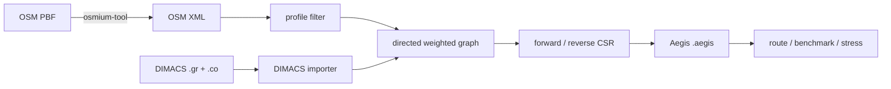
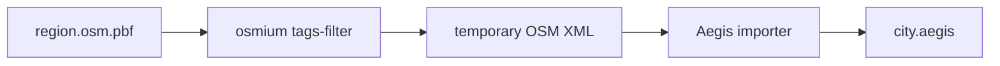
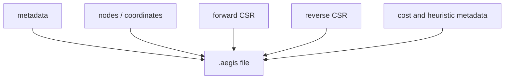

<div align="center">

# 道路データとグラフ形式

**OSM、PBF、DIMACSをAegisの探索用グラフへ変換する流れ。**


[ドキュメント一覧](README.md) · [アルゴリズム](ALGORITHM.md) · [ベンチマーク](BENCHMARKING.md) · [トップ](../README.ja.md)

</div>

---

## データpipeline



## 対応形式

| 入力 | 用途 | 座標 | 重み | importer |
|---|---|:---:|---|---|
| OSM XML | 道路networkの直接取り込み | ✓ | 距離 / 推定時間 | `import-osm` |
| OSM PBF | 大規模OSM配布形式 | ✓ | 距離 / 推定時間 | `scripts/import-pbf.sh`経由 |
| DIMACS `.gr` | shortest-path challengeのarc data | 任意 | 入力値を保持 | `import-dimacs` |
| DIMACS `.co` | `.gr`用の座標 | ✓ | — | `import-dimacs` |
| Aegis `.aegis` | 実行時のbinary graph | ✓ | 確定済み | route / benchmark |

## OSM XML

Aegis importerはOSM XMLをstream処理し、nodeとwayから走行可能な有向辺を構築します。

### 対応する主な要素

<table>
<tr>
<td width="50%" valign="top">

#### 道路構造

- 連続するway node間の辺
- `oneway=yes`
- `oneway=-1`
- roundabout
- profileに関係するaccess restriction

</td>
<td width="50%" valign="top">

#### cost計算

- `maxspeed`のkm/h表記
- `maxspeed`のmph表記
- highway type別の保守的default speed
- 距離weight
- 推定travel-time weight

</td>
</tr>
</table>

### profile

| profile | 対象 |
|---|---|
| `car` | 自動車向けhighwayとaccess rule |
| `bike` | 自転車向け通行可能way |
| `walk` | 歩行可能way |

profileはOSM tagのfilterとdefault speedへ影響します。

```bash
aegis import-osm \
  --input map.osm \
  --output city-time.aegis \
  --profile car \
  --metric time
```

> [!WARNING]
> 現在のimporterはOSM relationとturn restrictionを実装していません。したがって、交差点での右左折禁止やturn penaltyを含むproduction navigation engineではなく、構築したgraph上の最短経路を測定します。

## OSM PBF

Aegis本体はdependency-freeなXML importerを維持します。PBFは`osmium-tool`でXMLへ変換してから取り込みます。

```bash
scripts/import-pbf.sh \
  region.osm.pbf \
  city-distance.aegis \
  car \
  distance
```



大規模importでは、作業disk容量、temporary file、OS resource limitを確認してください。

## DIMACS

Ninth DIMACS Shortest Paths Challengeのarc形式`.gr`と、任意の座標`.co`を読み込めます。

- `.gr`のedge weightは変更せず保持
- `.co`がある場合は地理potential用の座標として使用
- 座標がない場合はheuristicを`0`として厳密探索

```bash
aegis import-dimacs \
  --graph USA-road-d.NY.gr \
  --coords USA-road-d.NY.co \
  --output ny-distance.aegis
```

## Aegis binary graph

`.aegis`は、query時に再parseせず使える探索用binary graphです。

| 構成 | 内容 |
|---|---|
| metadata | graph名、source、profile、metric |
| node data | ID、緯度、経度 |
| forward CSR | `outOffsets`, `outEdges` |
| reverse CSR | `inOffsets`, `inEdges` |
| cost metadata | edge weight、`min_cost_per_meter`など |



> [!IMPORTANT]
> 外部から受け取った`.aegis`、OSM、DIMACS fileはuntrusted inputとして扱ってください。運用上の注意は[セキュリティポリシー](../SECURITY.md)に記載しています。

## 同梱fixture

`benchdata/hatfield-uk.osm`は、実OSM由来の小規模extractです。

| 用途 | 適否 |
|---|:---:|
| deterministic test | ✓ |
| importer smoke test | ✓ |
| HTML report確認 | ✓ |
| release再現手順 | ✓ |
| 大規模性能主張の唯一の根拠 | ✗ |

小規模fixtureはtimer resolutionやcacheの影響を強く受けます。性能評価には都市規模の複数graphを使用してください。

## import後の確認

```bash
aegis inspect --graph city.aegis

aegis route \
  --graph city.aegis \
  --source SOURCE_NODE_ID \
  --target TARGET_NODE_ID \
  --algorithm aegis
```

`SOURCE_NODE_ID`と`TARGET_NODE_ID`は、対象graphに実在するOSMまたはDIMACS node IDへ置き換えます。`lat,lon`形式も指定できます。

確認項目:

- node / edge countが想定範囲か
- metricとprofileが正しいか
- strongly connected queryを生成できるか
- source / target座標が妥当か
- AegisとDijkstraのdistanceが一致するか
- graph checksumを保存したか

---

<div align="center">

[クイックスタート](../README.ja.md#クイックスタート) · [ベンチマーク方法](BENCHMARKING.md) · [セキュリティ](../SECURITY.md) · [ドキュメント一覧](README.md)

</div>
