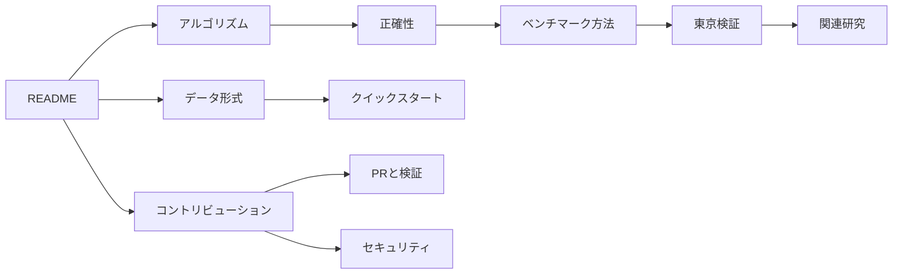

# Aegis ACBS ドキュメント

**仕組み、正確性、測定方法、研究結果を日本語で追える技術資料。**

[トップへ戻る](../README.ja.md) · [English README](../README.md) · [GitHub Issues](https://github.com/lasder-ca/aegis-acbs/issues)

---

> [!NOTE]
> 文書内では、コード上の識別子と研究分野で一般的な用語を保つため、`frontier`、`potential`、`scheduler`、`incumbent`などを英語表記のまま使用する場合があります。最初に登場する箇所では日本語の意味を併記します。

## 目的から選ぶ

<table>
<tr>
<td width="50%" valign="top">

### 仕組みを理解する

- **[アルゴリズム](ALGORITHM.md)**  
  状態、上下界、balanced potential、scheduler、停止条件
- **[正確性](CORRECTNESS.md)**  
  仮定、不変条件、補題、最短性の証明、機械検査
- **[関連研究](RELATED_WORK.md)**  
  既存の双方向探索との関係、主張できる範囲、比較課題

</td>
<td width="50%" valign="top">

### 実験を理解・再現する

- **[ベンチマーク方法](BENCHMARKING.md)**  
  測定順序、統計、メモリ、比較値、tail解析
- **[東京検証](TOKYO_EVIDENCE.md)**  
  10,000クエリ、生データ、再測定、ゲート、不採用実験
- **[データ形式](DATA.md)**  
  OSM、PBF、DIMACS、Aegisバイナリグラフ

</td>
</tr>
<tr>
<td width="50%" valign="top">

### 開発に参加する

- **[コントリビューション](../CONTRIBUTING.md)**  
  開発フロー、ローカル検査、アルゴリズム変更の要件
- **[セキュリティ](../SECURITY.md)**  
  対応バージョン、非公開報告、運用時の注意

</td>
<td width="50%" valign="top">

### プロジェクト情報

- **[変更履歴](../CHANGELOG.md)**
- **[リリースノート](../RELEASE_NOTES.md)**
- **[ライセンス](../LICENSE)**
- **[行動規範](../CODE_OF_CONDUCT.md)**

</td>
</tr>
</table>

## 読み進め方

| 読みたい内容 | 推奨順序 |
|---|---|
| ACBSの仕組み | アルゴリズム → 正確性 |
| 数値の意味 | ベンチマーク方法 → 東京検証 |
| 研究上の位置づけ | 関連研究 → 東京検証 |
| データを取り込みたい | データ形式 → READMEのクイックスタート |
| 実装を変更したい | コントリビューション → アルゴリズム → 正確性 |
| 問題を安全に報告したい | セキュリティ |

## 文書の共通方針

- **事実と解釈を分離する:** 測定値、推論、未確認事項を混同しません。
- **失敗した実験も残す:** 不採用結果とゲート条件を再現可能な形で記録します。
- **正確性を優先する:** 性能変更はDijkstraとの一致と停止証明を維持する必要があります。
- **誇張しない:** 第三者検証前の新規性や一般化性能を確定事項として扱いません。

---

[トップへ戻る](../README.ja.md) · [Issueを開く](https://github.com/lasder-ca/aegis-acbs/issues/new/choose)

