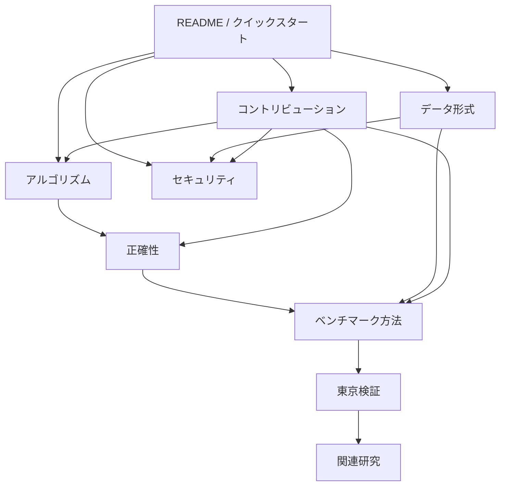

# Aegis ACBS 技術ドキュメント

**アルゴリズムの仕組みから大規模検証、開発参加、脆弱性報告までを日本語で追える資料集。**

[トップ](../README.ja.md) · [クイックスタート](../README.ja.md#クイックスタート) · [変更履歴](../CHANGELOG.md) · [GitHub Issues](https://github.com/lasder-ca/aegis-acbs/issues)

---

> [!NOTE]
> 本文は日本語を基準にしています。`frontier`、`potential`、`scheduler`、`incumbent`など、コードや研究文献と対応させる必要がある語は英語識別子を併記します。

## 8つの主要文書

<table>
<tr>
<td width="50%" valign="top">

### 01 — [アルゴリズム](ALGORITHM.md)

**探索内部を理解するための中心文書。**

- 前向き・後ろ向き探索の状態
- 上界 `U` と共有下界 `L`
- balanced feasible potential
- edge-work scheduler
- `L ≥ U`による停止条件

`状態 → potential → 上下界 → scheduler → 停止`の順で読めます。

</td>
<td width="50%" valign="top">

### 02 — [正確性](CORRECTNESS.md)

**なぜ返却経路が厳密最短になるのか。**

- グラフと重みに対する仮定
- heuristicの許容性・整合性
- reduced edge costの非負性
- 結合下界の安全性
- 実装上の不変条件と機械検査

証明の流れをMermaid図と補題で追えます。

</td>
</tr>
<tr>
<td width="50%" valign="top">

### 03 — [ベンチマーク方法](BENCHMARKING.md)

**数値を公平に測り、正しく読むための規則。**

- 方式を交互に測る実行順序
- p50 / p95 / p99と絶対時間差
- allocationとpeak RSS
- speedup / regretの定義
- tail検出、複数seed、隔離再測定

結果を見る前に採用条件を固定する方針も記載しています。

</td>
<td width="50%" valign="top">

### 04 — [東京検証](TOKYO_EVIDENCE.md)

**大規模道路グラフで得た観測結果と失敗実験。**

- 611,846ノード / 1,235,323有向辺
- 10,000クエリの正確性確認
- tailの隔離再測定
- guard候補の事前定義ゲート
- 不採用理由、生データ、診断ルール

成功した結果だけでなく、不合格だった候補も残しています。

</td>
</tr>
<tr>
<td width="50%" valign="top">

### 05 — [関連研究](RELATED_WORK.md)

**既存の双方向探索研究との位置関係。**

- Bidirectional Dijkstra / A*
- MM / MMe
- NBS
- DVCBS
- BAE*
- tight termination

既知の要素と、独立検証が必要な組み合わせを分離しています。

</td>
<td width="50%" valign="top">

### 06 — [データ形式](DATA.md)

**道路データを探索用グラフへ変換する方法。**

- OSM XML
- OSM PBF
- DIMACS `.gr` / `.co`
- Aegis `.aegis`形式
- forward / reverse CSR
- import後の検査項目

入力形式ごとの制約と安全上の注意も確認できます。

</td>
</tr>
<tr>
<td width="50%" valign="top">

### 07 — [コントリビューション](../CONTRIBUTING.md)

**変更を安全に提案・検証するための開発手順。**

- branchからPRまでの流れ
- 必須のローカル検査
- アルゴリズム変更の検証要件
- benchmark gate
- Pull Requestチェックリスト

正確性、再現性、不利な結果の保存を必須としています。

</td>
<td width="50%" valign="top">

### 08 — [セキュリティ](../SECURITY.md)

**脆弱性報告と安全な運用の方針。**

- 対応バージョン
- 非公開Security Advisory
- untrusted inputの扱い
- HTTP公開時の注意
- checksumとrelease artifactの確認

脆弱性の詳細は公開Issueへ投稿しないでください。

</td>
</tr>
</table>

## 全体の関係

## 目的別の読み方

| 目的 | 推奨順序 |
|---|---|
| ACBSの仕組みを知る | アルゴリズム → 正確性 |
| ベンチマークの数値を読む | ベンチマーク方法 → 東京検証 |
| 新規性や既存研究との関係を確認する | 関連研究 → アルゴリズム → 東京検証 |
| OSMやDIMACSを取り込む | データ形式 → クイックスタート |
| schedulerや停止条件を変更する | コントリビューション → アルゴリズム → 正確性 → ベンチマーク方法 |
| 不具合を報告する | コントリビューション |
| 脆弱性を非公開で報告する | セキュリティ |

## 文書で使う主要用語

| 用語 | この文書群での意味 |
|---|---|
| frontier | 一方向の探索境界。priority queueと未確定labelを含む |
| potential | 辺コストを安全に変換し、探索を誘導する頂点関数 |
| scheduler | 次の辺処理chunkを前後どちらへ配るか決める部分 |
| upper bound / 上界 | 実在する発見済み完全経路の最良コスト |
| lower bound / 下界 | 未確定経路が下回れない安全な境界 |
| incumbent | 現在までに見つかった最良の完全経路 |
| tail | 通常分布から外れた遅いクエリや再現可能な性能端部 |
| gate | 変更採用前に固定する合格条件 |

## 共通方針

<table>
<tr>
<td align="center"><strong>正確性を優先</strong> Dijkstraとの差分検査と停止証明を維持</td>
<td align="center"><strong>測定を再現</strong> seed・command・raw reportを保存</td>
<td align="center"><strong>失敗も公開</strong> 不採用候補と判定理由を残す</td>
<td align="center"><strong>主張を限定</strong> 観測条件と未確認事項を明記</td>
</tr>
</table>

> [!IMPORTANT]
> 測定値、実装上の事実、そこからの推論、未確認事項を同じ強さで書きません。学術的新規性や一般化性能は、第三者検証前の確定事項として扱いません。

---

[トップへ戻る](../README.ja.md) · [最初にアルゴリズムを読む](ALGORITHM.md) · [Issueを開く](https://github.com/lasder-ca/aegis-acbs/issues/new/choose)

