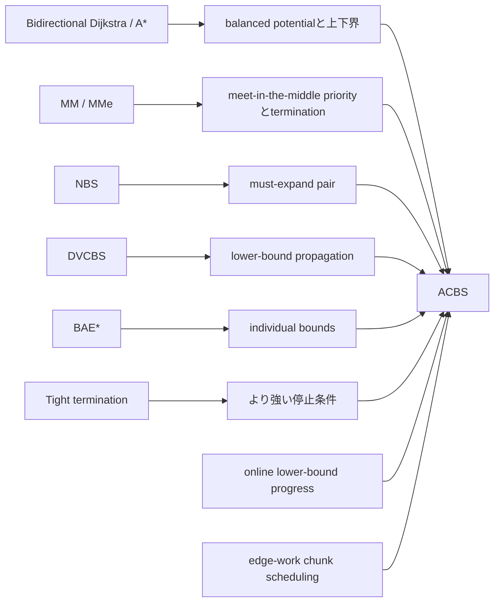
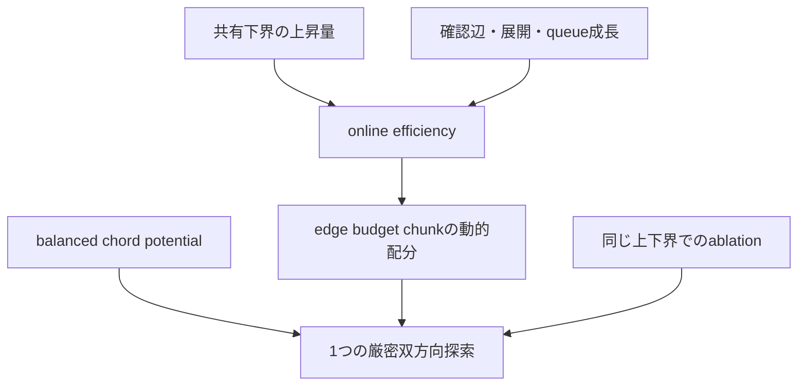

# 関連研究と主張の境界

**ACBSが既存研究から借りている要素と、独自性候補として検証すべき部分を分ける。**

[ドキュメント一覧](README.md) · [アルゴリズム](ALGORITHM.md) · [東京検証](TOKYO_EVIDENCE.md) · [トップ](../README.ja.md)

---

> [!IMPORTANT]
> この文書は優先権や新規性を主張するためのものではありません。ACBSの構成要素を既存研究へ位置づけ、比較不足を明示するための作業文書です。

## 研究地図

上図の矢印は「ACBSがその研究を完全実装している」という意味ではありません。問題設定、証明道具、比較対象として近い関係を示します。

## 直接関係する研究系列

| 系列 | 主な論点 | ACBSで比較すべき点 |
|---|---|---|
| Bidirectional Dijkstra / A* | 前後frontier、接続、停止条件 | 基本的なworkとlatency |
| MM / MMe | meet-in-the-middleを保証するpriorityとtermination | 探索の中心化、展開分布 |
| NBS | must-expand pairとnear-optimal expansion | node expansion保証との関係 |
| DVCBS | lower-bound propagation | 結合下界の強さと計算コスト |
| BAE* | individual heuristic-error bound | queryごとのbound精度 |
| Tight termination | より強い双方向停止条件 | 停止判定回数、追加計算量、tail |

## ACBSが新規とは主張しない要素

<table>
<tr>
<td width="50%" valign="top">

### 探索理論

- 2つのfrontierを使う厳密探索
- 許容的・整合的heuristic
- feasible / balanced potential
- reduced cost
- incumbent upper bound
- lower-bound termination
- A*型のincumbent pruning

</td>
<td width="50%" valign="top">

### 実装技術

- workspace reuse
- monotone integer key向けradix heap
- CSR graph storage
- OSM / DIMACS import
- reverse adjacency
- benchmark interleaving

</td>
</tr>
</table>

これらは既存の理論・実装技術です。ACBSの説明では、個々の要素を発明したように表現しません。

## 暫定的なcontribution候補

ACBSで独立検証すべき組み合わせは次です。

1. balanced chord potentialによる低コストな双方向reduced-cost探索
2. 結合下界の進行量を、確認辺・展開頂点・queue成長で正規化するonline efficiency
3. そのefficiencyに応じたedge-work chunkの動的配分
4. 同一の上下界と停止証明を保ったscheduler ablation
5. 成功・失敗双方をquery単位で追えるreplay / trigger profiling workflow

> [!WARNING]
> この組み合わせが既存研究と実質的に異なるかは未確認です。特にNBS / DVCBS / BAE* / tight terminationとの数式・実装比較が必要です。

## 比較matrix

| 比較対象 | 正確性 | latency | work | memory | tail | 実装済み |
|---|:---:|:---:|:---:|:---:|:---:|:---:|
| Dijkstra | ✓ | ✓ | ✓ | ✓ | ✓ | ✓ |
| Bidirectional Dijkstra | ✓ | ✓ | ✓ | ✓ | ✓ | ✓ |
| A* | ✓ | ✓ | ✓ | ✓ | ✓ | ✓ |
| `aegis-static` | ✓ | ✓ | ✓ | ✓ | ✓ | ✓ |
| MM / MMe | 要比較 | 要比較 | 要比較 | 要比較 | 要比較 | — |
| NBS | 要比較 | 要比較 | 要比較 | 要比較 | 要比較 | — |
| DVCBS | 要比較 | 要比較 | 要比較 | 要比較 | 要比較 | — |
| BAE* | 要比較 | 要比較 | 要比較 | 要比較 | 要比較 | — |
| tight termination | 要比較 | 要比較 | 要比較 | 要比較 | 要比較 | — |

## 比較時に報告する値

<table>
<tr>
<td width="50%" valign="top">

### 性能

- p50 / p95 / p99 latency
- expanded nodes
- relaxed edges
- queue push / pop / stale pop
- peak RSS
- allocation bytes / objects

</td>
<td width="50%" valign="top">

### 証明と探索挙動

- first upper-bound point
- upper-bound update count
- pruning count
- potential evaluation count
- direction switches / chunk count
- termination lower bound
- upper bound / optimality gap
- route class別結果

</td>
</tr>
</table>

## 新規性確認の手順

- 同じgraphとquery pairを使う
- preprocessing costとindex sizeを分離して報告する
- work counterの定義を揃える
- timeoutや未到達queryの扱いを明記する
- 不利な結果も除外しない
- ACBS固有の診断機能を比較方式のruntimeへ混ぜない

## 表現ルール

第三者reviewと既存実装比較が終わるまで、次の表現は使用しません。

- 「世界初」
- 「最先端」
- 「既存方式を上回る」
- 「常に高速」
- 「新しいアルゴリズムであることが証明済み」

使用できる表現は、観測条件を明示したものです。

> 東京時間グラフの指定suiteでは、10,000queryすべてでDijkstraと最短距離が一致した。

## 主要文献

1. Holte et al., “MM: A bidirectional search algorithm that is guaranteed to meet in the middle,” *Artificial Intelligence* 252, 2017. DOI: `10.1016/j.artint.2017.05.004`.
2. Chen et al., “Front-to-End Bidirectional Heuristic Search with Near-Optimal Node Expansions,” 2017. arXiv: `1703.03868`.
3. Shperberg et al., “Bidirectional Heuristic Search: Expanding Nodes by a Lower Bound,” IJCAI 2020. DOI: `10.24963/ijcai.2020/664`.
4. Alcázar, Riddle, Barley, “A Unifying View on Individual Bounds and Heuristic Inaccuracies in Bidirectional Search,” AAAI 2020. DOI: `10.1609/aaai.v34i03.5611`.
5. Wang et al., “Bidirectional Search while Ensuring Meet-In-The-Middle via Effective and Efficient-to-Compute Termination Conditions,” IJCAI 2025. DOI: `10.24963/ijcai.2025/999`.

> [!NOTE]
> 文献一覧は網羅的ではありません。関連実装、反例、より直接的な先行研究の指摘は歓迎します。

---

[アルゴリズム](ALGORITHM.md) · [東京検証](TOKYO_EVIDENCE.md) · [コントリビューション](../CONTRIBUTING.md) · [ドキュメント一覧](README.md)

