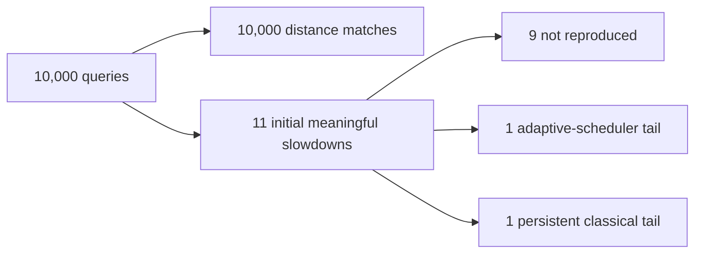
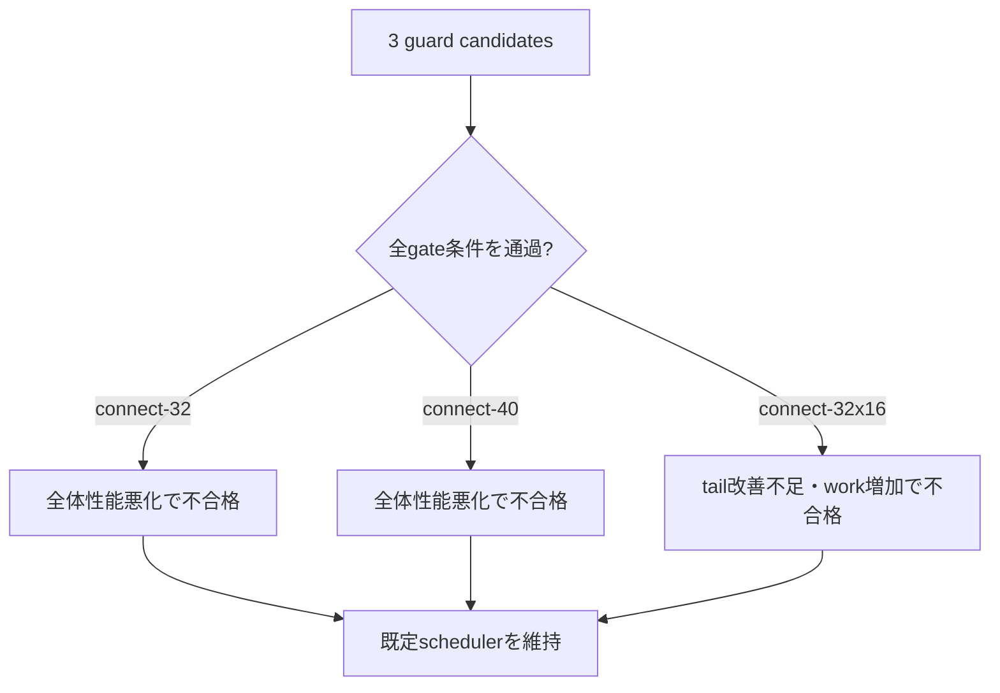

<div align="center">

# 東京時間グラフ検証

**大規模道路グラフでの正確性、tail再測定、guard gate、診断triggerの記録。**


[ドキュメント一覧](README.md) · [ベンチマーク方法](BENCHMARKING.md) · [アルゴリズム](ALGORITHM.md) · [トップ](../README.ja.md)

</div>

---

> [!NOTE]
> この文書は、最初の公開版へ収録したユーザー実行の観測結果です。1つのgraph、query生成方法、machine環境に対する証拠であり、すべての道路網での性能を保証するものではありません。

## 実験概要

<table>
<tr>
<td align="center"><strong>611,846</strong><br><sub>nodes</sub></td>
<td align="center"><strong>1,235,323</strong><br><sub>directed edges</sub></td>
<td align="center"><strong>10,000</strong><br><sub>queries</sub></td>
<td align="center"><strong>0</strong><br><sub>correctness failures</sub></td>
</tr>
</table>

| 項目 | 内容 |
|---|---|
| graph | 東京道路網、時間重み付き |
| 実行環境 | WSL Ubuntu、特記がないbenchmarkはsingle-thread |
| 実行日 | 2026年7月18日 |
| query suite | deterministic mixed、strongly connected pool内のsource-target pair |
| 正確性oracle | Dijkstraが返す最短距離 |
| meaningful slowdown | 最速classical baselineの`1.25×`以上、かつ絶対penalty`1 ms`以上 |
| 生データ | `research/tokyo-time-2026-07-18/` |

release importerは、公開前にchecksumと期待summaryを検証します。

## 10,000-query validation



<table>
<tr>
<td align="center"><strong>10,000 / 10,000</strong><br><sub>Dijkstraと最短距離が一致</sub></td>
<td align="center"><strong>11 / 10,000</strong><br><sub>初回meaningful slowdown</sub></td>
<td align="center"><strong>0.075 ms</strong><br><sub>全体p95 absolute penalty</sub></td>
<td align="center"><strong>14.469 ms</strong><br><sub>最大absolute penalty</sub></td>
</tr>
</table>

| 指標 | 観測値 |
|---|---:|
| meaningful slowdown rate | **0.110000%** |
| Wilson 95% interval | 0.061435%〜0.196880% |
| correctness failures | **0** |

最大absolute penaltyは、必ずしもratio条件も満たしたmeaningful slowdownとは限りません。絶対差と比率は別々に扱います。

## 隔離replay

初回に保持した11queryをwarm-up後に繰り返し測定しました。

| classification | 件数 | 意味 |
|---|---:|---|
| `not-reproduced` | 9 | 元matrixのoutlierが隔離反復では残らなかった |
| `adaptive-scheduler-tail` | 1 | 固定schedulerが適応schedulerを明確に上回った |
| `persistent-classical-tail` | 1 | classical方式の優位が残り、schedulerだけでは説明できなかった |
| correctness failure | **0** | 全方式で最短距離一致 |

再現した2件:

| seed / query | class | 判定 |
|---|---|---|
| `1010 / 877` | `random` | adaptive-scheduler tail |
| `271828182 / 279` | `local` | persistent classical tail |

> [!IMPORTANT]
> 11件中9件は隔離測定で再現しませんでした。単発のtiming outlierを、そのままscheduler設計へ反映しないための工程です。

## guard実験と事前定義gate

結果を見る前に、次の全条件を合格条件として固定しました。

- 再現scheduler tailを`0.5 ms`以上改善
- persistent classical tailの悪化を`1 ms`未満に維持
- 全queryで最短距離一致
- 全体mean、median、p95、relaxed、expandedの悪化がそれぞれ`1%`以内

| candidate | scheduler-tail gain | mean | median | p95 | relaxed | expanded | 判定 |
|---|---:|---:|---:|---:|---:|---:|---|
| `aegis-connect-32` | 0.778 ms | 1.1595× | 1.0430× | 1.1498× | 1.0492× | 1.0472× | **不採用** |
| `aegis-connect-40` | 0.732 ms | 1.1498× | 1.0210× | 1.1552× | 1.0252× | 1.0294× | **不採用** |
| `aegis-connect-32x16` | 0.283 ms | 0.9996× | 0.9948× | 0.9934× | 1.0123× | 1.0246× | **不採用** |



結果判明後もthresholdは変更していません。

## whole-suite trigger profiling

全10,000queryについて、chunk `24 / 32 / 40 / 48`のdeterministic featureを記録しました。隔離replayで確認したscheduler tailをpositive labelとしました。

最上位のsame-suite rule:

```text
checkpoint = 48
switchRate <= 0.458333333
```

<table>
<tr>
<td align="center"><strong>1</strong><br><sub>total matches</sub></td>
<td align="center"><strong>1</strong><br><sub>positive matches</sub></td>
<td align="center"><strong>0</strong><br><sub>false positives</sub></td>
<td align="center"><strong>0</strong><br><sub>unstable labels / trace errors</sub></td>
</tr>
</table>

> [!WARNING]
> 同じsuiteでruleを発見し、そのまま評価しています。別seed・別都市での外部検証前なので、既定schedulerへは採用していません。これは診断上の仮説です。

## この実験から言えること

### 支持された範囲

- 10,000queryすべてでDijkstraと最短距離が一致した
- 初回tailの大半は隔離replayで消えた
- 安定したscheduler由来tailが1件残った
- 安定したclassical方式優位が1件残った
- 広いguard条件は事前定義gateを通過しなかった

### この実験だけでは言えないこと

- すべての入力で正しいという形式的保証
- すべての道路網で最速という主張
- academic noveltyの確定
- checkpoint ruleが他都市・他workloadへ移ること
- preprocessing方式を含むproduction routerより速いこと

## 再現用ファイル

`research/tokyo-time-2026-07-18/`には、少なくとも次のraw artifactを保存します。

- multi-seed validation JSON
- isolated replay JSON / CSV / HTML
- guard benchmark JSON / HTML
- release-gate JSON
- trigger-profile JSON / CSV / HTML
- checksumとsummary

判定ロジックは[ベンチマーク方法](BENCHMARKING.md)に記載しています。

---

<div align="center">

[ベンチマーク方法](BENCHMARKING.md) · [関連研究](RELATED_WORK.md) · [ドキュメント一覧](README.md)

</div>
